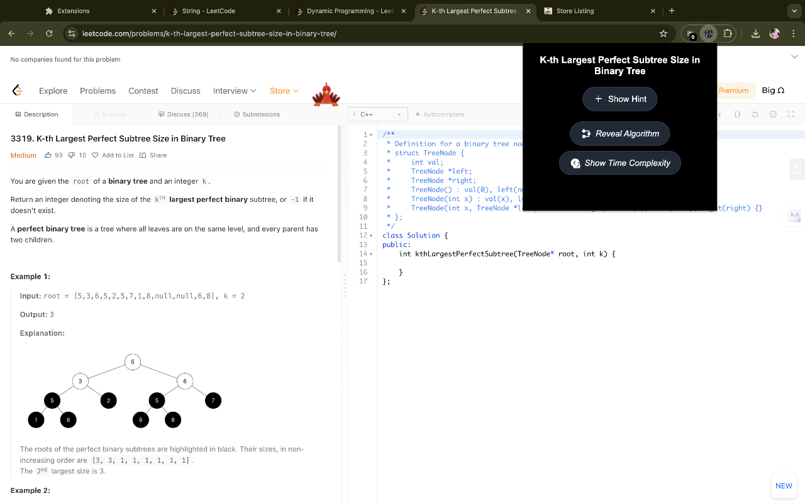
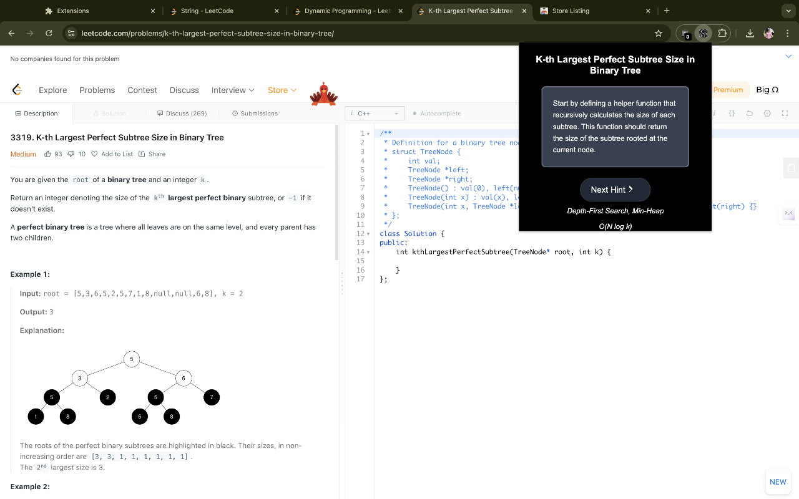
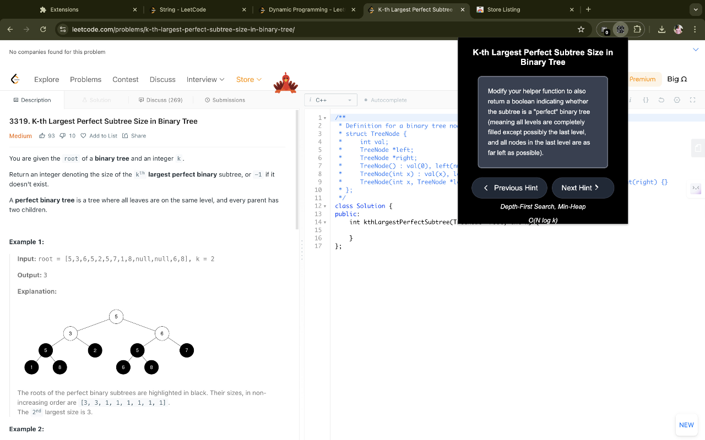
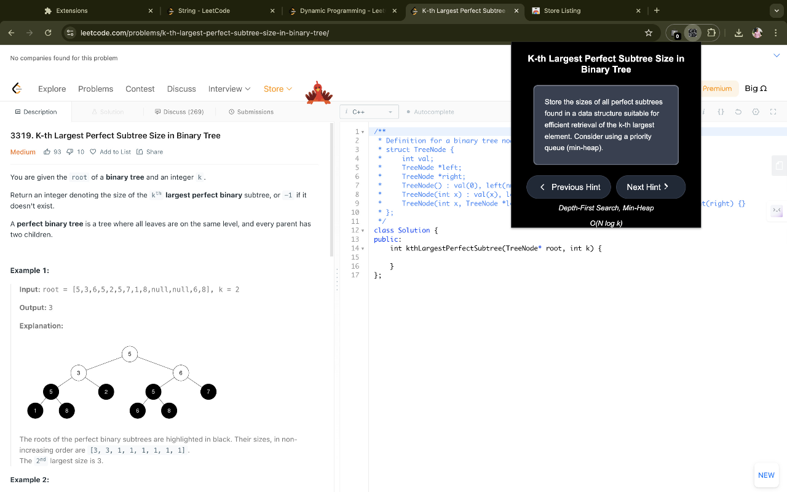

# LeetCode Hint Helper

**LeetCode Hint Helper** is a powerful Chrome extension designed to enhance your problem-solving experience on LeetCode. With step-by-step hints, algorithm insights, and time complexity analysis, this extension simplifies even the toughest coding challenges.

---

## Features

- **Step-by-Step Hints**: Get detailed hints that guide you progressively from understanding the problem to solving it efficiently.
- **Algorithm Insights**: Learn about the best algorithms or data structures to solve each problem.
- **Time Complexity Analysis**: Understand the optimal time complexity of the solution.
- **Automatic Detection**: The extension detects the active problem on LeetCode and fetches relevant hints automatically.
- **Customizable API Integration**: Use your OpenAI or Gemini API keys to fetch personalized hints and solutions.

---

## How to Use

### **Setup Your API Keys**
1. On first launch, the extension will ask you to enter your **OpenAI API Key** and/or **Gemini API Key**.
2. Enter your keys in the provided input fields and click **Save API Keys**.
   - **Optional**: You can skip entering the keys, but the extension will use the default admin key with limited functionality.

### **Using the Extension**
1. Open a problem on **LeetCode**.
2. The extension will automatically detect the problem title and fetch:
   - Up to 5 step-by-step hints.
   - Algorithm details.
   - Time complexity analysis.
3. View the fetched data directly in the extension popup.

---

### **Screenshots and Demo**
Below is a video demonstration followed by screenshots:

### **Video Walkthrough**
[](Screenshots/5.mp4)

---

### **Screenshots**

<div align="center">
  
  
</div>

<div align="center">
  
  
</div>

---

## Installation

### **From Chrome Web Store**
1. Go to the **Chrome Web Store**.
2. Search for **LeetCode Hint Helper**.
3. Click on **Add to Chrome**.
4. Confirm by clicking **Add Extension**.
5. Open a LeetCode problem, and the extension will be ready to use!

---

### **Manual Installation from GitHub**
If you want to install the extension manually from the GitHub repository:

1. **Download the Repository**:
   - Clone the repository:
     ```bash
     git clone https://github.com/username/leetcode-hint-helper.git
     ```
   - Or download it as a ZIP file and extract it.

2. **Load the Extension in Chrome**:
   - Open Chrome and navigate to `chrome://extensions/`.
   - Enable **Developer mode** (toggle in the top-right corner).
   - Click **Load unpacked** and select the folder where you extracted the repository.

3. **Set Up Your API Keys**:
   - On the first launch, enter your **OpenAI API Key** and/or **Gemini API Key**.

4. **Use the Extension**:
   - Open a LeetCode problem, and the extension will fetch hints automatically.

---

## Permissions Justification

The extension requires the following permissions to function effectively:

1. **Storage**: To store API keys and fetched hints for reuse during your session.
2. **Scripting**: To inject scripts into LeetCode pages and extract the problem title.
3. **ActiveTab**: To interact with the currently open LeetCode problem page.
4. **Host Permission**: Access to `https://leetcode.com/problems/*` to detect the problem you’re working on.

---

## Contribution

We welcome contributions! If you'd like to report an issue or contribute to the project:
1. Fork the repository.
2. Make your changes and create a pull request.
3. Ensure your changes comply with the Chrome Web Store policies.

---

